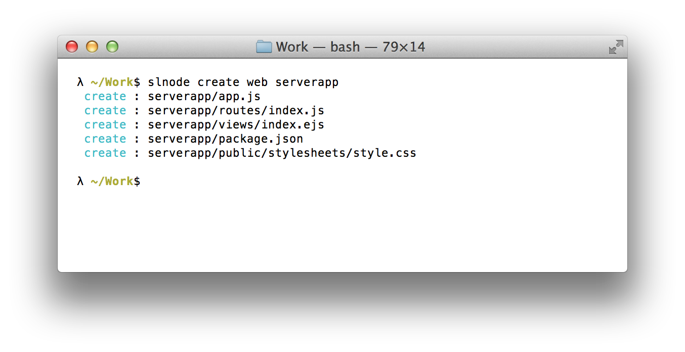
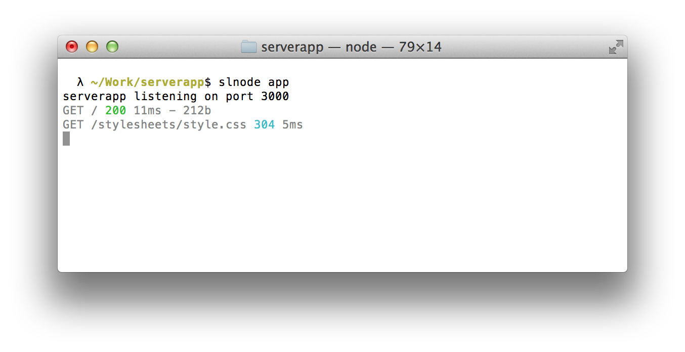

Workshop 2: Building a Website in Node.js
========

- Recap of our basic web server from [workshop 1](https://github.com/strongloop/nodejs-workshops/blob/master/workshop01.md)
- Creating a more advanced server with express
 - Internals
 - Middleware
- How page routes work
 - Adding your own
 - Deeper dive on the `render` method
- Rounding out our server
 - Setting up static assets
 - Custom 404 page
 - Authentication

What this Workshop Covers
--------

In [workshop 1](https://github.com/strongloop/nodejs-workshops/blob/master/workshop01.md) we learned about how Node.js works, installed the [StrongLoop Node distribution](http://strongloop.com/products) and built some starter apps.

One of those applications was a simple web server based on the core `http` library:

```javascript
var http = require("http");

http.createServer(function (req, res) {
  res.writeHead(200, { "Content-Type" : "text/plain" });
  res.end("Hello World\n");
}).listen(1337, "127.0.0.1");

console.log("Server running at http://127.0.0.1:1337/");
```

Now we’ll expand our sphere of knowledge to include `express` which builds on the `http` library to provide all of the functionality you will likely need in a web server.


Creating a more advanced server with express
-------

The `slnode` command-line tool ships standard with [StrongLoop Node](http://strongloop.com/products). We can use it to:

- Initialize a new StrongLoop Node project, and create boilerplate code for servers, modules and CLI tools
- Run a specified script
- Print node environment information
- Run tests

We are going to use the command `slnode create` to scaffold a web server, which uses the [express web server](http://expressjs.com/) at its core. Express is one of the most popular web frameworks for Node.js. It handles all the details of serving content, rendering templates (e.g. Jade, EJS) and route handling.

#### Using `slnode create`

`slnode` contains a few subcommands that make it really convenient to create a few different types of Node.js applications. Entering `slnode create` presents the following options:

- cli - creates an empty cli program
- module - creates an empty module in the current application
- package - creates a full node module package
- web - a simple express app with optional mongoose support

We are going to create a web app, so go ahead and type `slnode create web [name]` where [name] is the name of the folder you want to create.



#### Running the Server

To run your freshly minted web app:

```bash
$ cd serverapp
$ slnode install
... bunch of output
$ slnode app
```

Running `slnode install` will result in a lot of output. What this is doing is using NPM to install all of our project's library dependencies &mdash; namely, express and a templating language called EJS.

This is what you should see in your terminal when running `slnode app` and then accessing the server at [http://localhost:3000](http://localhost:3000):



The Internals
-------

Running `slnode create web serverapp` has scaffolded our folders and files like so:

```
+ node_modules
+ public
+ routes
+ views
  app.js
  package.json
```

The application entry point is `app.js`. Let's take a look inside and break it down piece by piece.

```javascript
var express = require('express')
  , routes = require('./routes')
  , http = require('http')
  , path = require('path');

var app = express();
```

After we load in all our dependencies we create the application with `var app = express();`

```javascript
app.configure(function(){
  app.set('port', process.env.PORT || 3000);
  app.set('views', __dirname + '/views');
  app.set('view engine', 'ejs');
  app.use(express.favicon());
  app.use(express.logger('dev'));
  app.use(express.bodyParser());
  app.use(express.methodOverride());
  app.use(app.router);
  app.use(express.static(path.join(__dirname, 'public')));
});
```

Here we are configuring express. Our configuration options are set with `app.set` &mdash; you can see how this works and the different options on the [express app.configure api page](http://expressjs.com/api.html#app.configure).

`app.use` is the interface for setting up _middleware_, an important concept in the express ecosystem.

Express Middleware
-------

Generally if you use `slnode create` to set up your server then you shouldn't have to touch the middleware. But it's a good idea to know how it works.

The middleware in our application was set in `app.configure` and consists of these functionality:

```
app.use(express.favicon());
app.use(express.logger('dev'));
app.use(express.bodyParser());
app.use(express.methodOverride());
app.use(app.router);
app.use(express.static(path.join(__dirname, 'public')));
```

Each piece of middleware is passed the incoming request from your website visitors, and then either does something with those requests or passes them on to the next piece of middleware.

#### The logger middleware

For instance, the line `app.use(express.logger('dev'));` uses the logging facility provided by express. Remember the output in your terminal after accessing your server for the first time? This is the logger in action.


#### Ordering middleware

Since middleware can determine whether a request is passed on to the next piece of middleware or not, the order by which you set up your middleware is paramount. For example, these are our first two pieces of middleware:

```javascript
app.use(express.favicon());
app.use(express.logger('dev'));
```

You may have noticed in our logger output we did not see a request for the favicon. This is because the favicon middleware stops the request from reaching the next piece of middleware, the logger. But what happens if we reverse the order of the middleware setup?

```javascript
app.use(express.logger('dev'));
app.use(express.favicon());
```

Look at the logger output again:

```bash
GET / 200 1ms - 212b
GET /stylesheets/style.css 200 1ms - 110b
GET /favicon.ico 200 3ms
```

Yep, the `favicon` middleware was stopping requests from going on to the next piece of middleware, so the logger was never seeing the favicon request (generally this is desirable since favicon requests are not particularly interesting). But once we put the logger at the top of the middleware order, we saw the favicon request the browser was making.

Here is the rest of app.js:

```javascript
app.configure('development', function(){
  app.use(express.errorHandler());
});

var options = {};

routes(app, options);

http.createServer(app).listen(app.get('port'), function(){
  console.log("serverapp listening on port " + app.get('port'));
});
```

You can see here when we actually create the server we are retrieving the 'port' configuration from express with `app.get('port')`. That was set earlier in the configuration section with this line:

`app.set('port', process.env.PORT || 3000);`


How page routes work
-------

If our website is going to have multiple pages, we need to add page routes. So when the client accesses:

- ourwebsite.com**/products**
- ourwebsite.com**/support**

...then the appropriate page ("products" or "support") is retrieved, rendered and returned to the client.

Our routing code exists in `routes/index.js` and is loaded into `app.js` using the `module.exports` method we discussed in [workshop 1](https://github.com/strongloop/nodejs-workshops/blob/master/workshop01.md).

```javascript
var express = require('express')
  , routes = require('./routes')

// ...some code...

// pass our app and some blank options to the function
// returned from routes.js --
routes(app, options);
```

Let's dive into `routes/index.js`.

```javascript
/*
 * GET home page.
 */
function index(req, res){
  res.render('index', { title: 'serverapp' });
};

/**
 * Set up routes
 */
module.exports = function(app, options) {
  app.get('/', index);  
}
```

The express `app` variable has different methods for the different HTTP verbs: "get", "post", "update", "delete". Towards the end of the file we are registering a route with the "get" method.

```javascript
app.get('/', index);
```

We are effectively saying "When the client asks for our homepage (i.e. '/'), call the `index` method and render the index page for the client."

Thus the file can effectively be rewritten like so:

```javascript
module.exports = function(app, options) {
  app.get('/', function(req, res) {
    res.render('index', { title: 'serverapp' });
  };
}
```

We keep these methods separate so it maintains its extensibility.

#### Adding your own route

Adding another route requires us to do two things:

- Add the route to `routes/index.js`
- Add a new template file to the `views` folder

We saw earlier that when the homepage '/' route was accessed, we called the `index` function which has this code:

```javascript
function index(req, res){
  res.render('index', { title: 'serverapp' });
};
```

The first argument to `res.render` is the name of the template file you want to render. When we set up our application config, we told express that our rendering engine is `ejs`. So in our views folder we should see a file `index.ejs`.

Sure enough:

```
+ node_modules
+ public
+ routes
- views
    index.ejs
  app.js
  package.json
```

First let's create a new file `views/products.ejs` with the following HTML:

```ejs
<!DOCTYPE html>
<html>
  <head>
    <title>Products</title>
    <link rel='stylesheet' href='/stylesheets/style.css' />
  </head>
  <body>
    <h1>Products</h1>
    <p>Available products:</p>
  </body>
</html>
```

Now let's add the "products" route to `routes/index.js`:

```javascript
/*
 * GET home page.
 */
function index(req, res){
  res.render('index', { title: 'serverapp' });
};

function products(req, res){
  res.render('products', { products: 'No products at this time' });
};

/**
 * Set up routes
 */
module.exports = function(app, options) {
  app.get('/', index);
  app.get('/products', products);
}
```

We simply added a new method `products` that is called when a visitor accesses the "/products" URL. You can try this out now by accessing your local server at [localhost:3000/products](http://localhost:3000/products) (be sure to restart the app first in your terminal).

#### Deeper dive on the `render` method

Express gives us a function called `render` on the `res` variable. The first two arguments of `render` are the name of the template you want to render and any variables you want to pass to the template.

`res.render('index', { title: 'serverapp' });`

Express knows where the 'index' template is because in  `app.js` when we were configuring express, we told it where to look.

```javascript
app.set('views', __dirname + '/views');
app.set('view engine', 'ejs');
```

There are a number of different engines that express supports. Jade, EJS, etc. You can get more info on your different template options on the [Expressjs website](http://expressjs.com).

Rounding out our web server
--------

All the other little pieces of code that make your website.

#### Setting up Static Assets

In app.js when we were configuring the application we set up the static middleware like so:

```javascript
app.use(express.static(path.join(__dirname, 'public')));
```

This means express will look in the "public" folder of our application directory for any assets we might reference in our template files. For example, in `index.ejs` we reference a stylesheet:

```html
<link rel='stylesheet' href='/stylesheets/style.css' />
```

It is important to note that we must spell out the path of the asset we request residing in the public folder. Since our CSS file is in `public/stylesheets/` and we have registered only `public` as a static route, we need to reference href='/stylesheets/style.css'. We could not write it this way:

```html
<link rel='stylesheet' href='style.css' />
```

#### Custom 404 Page

By default express will show a "Cannot GET [route]" if we have not registered that route. But we will likely want our own 404 page that matches the aesthetic of our site.

In `app.js` after all our `app.use` configuration lines add:

```javascript
app.use(function(req, res, next){
  res.render('404', {});
});
```

It is quite important that this be the last middleware configuration because we only want to catch the 404 route after all the other response opportunities have had their chance to respond.

We are rendering the '404' page which means the "404.ejs" template file needs to be created, like this:

```html
<!DOCTYPE html>
<html>
  <head>
    <title>404</title>
    <link rel='stylesheet' href='/stylesheets/style.css' />
  </head>
  <body>
    <h1>404</h1>
    <p>Sorry we couldn't find that page!</p>
  </body>
</html>
```

Exercise for the reader is to modify 404.ejs and the 404 middleware to pass on the route the client is trying to access, and display that on the 404 page.

e.g.

"Sorry we couldn't find the page [route]"

#### Authentication

Sometimes you need to protect your application from prying eyes. If that's the case, you can set up simple authentication. In `app.js` add the following code:

```javascript
app.use(express.basicAuth(function(user, pass) {
    return options.authName == "username" & options.authPass == "password";
}));
```

Be sure to put this middleware before any other middleware, so no requests can get past the authentication layer.